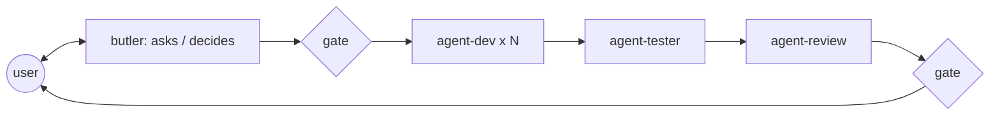

# ai-dev-crew

_A personal library of Claude Code skills and agents. Not a marketplace._

## What it is

A set of **skills** — short, verifiable checklists — plus a few **agents** that are only
convenient ways to load them. Skills carry all the behavior; agents add only what a skill
cannot: a tool restriction and a fresh context.

The library **is** the product. Agents are a convenience, never a dependency: everything the
crew does can be done by hand, one skill at a time, in a bare session.

## Two ways to use it

**At home, with Claude Code.** The skills in `.claude/skills/` and the agents in
`.claude/agents/` are auto-discovered when working in this repository. To have them
everywhere, link the library into your home directory:

```bash
ln -s "$PWD/.claude/skills"/* ~/.claude/skills/
ln -s "$PWD/.claude/agents"/* ~/.claude/agents/
claude --agent agent-butler   # a session driven by the butler
```

**On site, with no install and no choice of model.** No plugin, no agent: open the files for
the work at hand and paste them into the conversation. The router `crew/SKILL.md` lists what
to paste together.

## The skills

Three. **A skill never names another skill**: it references only its own files, so it works
alone, pasted or loaded ([ADR 0016](./docs/adr/0016-one-crew-skill-role-as-mode.md)).
One exception: `crew-builder` names `crew`, which it maintains ([ADR 0017](./docs/adr/0017-crew-maintenance-out-of-crew.md)).

| Command | When | Goes to the client |
| --- | --- | --- |
| `/crew` | develop, test, review, orchestrate, decide | yes |
| `/crew-project` | the domain or the house names are not visible in the code | the router, not the projects |
| `/crew-builder` | add a file to `crew` (`-n`), repair the structure (`-d`), watch its rules (`-w`) | **never** |

`/crew` detects the techno, picks the role, and that is all:

```
/crew  →  techno detected  →  agents/agent-dev.md  →  technos/spring.md  →  references/…
```

| Flag | Agent | Role |
| --- | --- | --- |
| *(none)* · `-d` | `agent-dev` | develops, writes the tests |
| `-t` | `agent-tester` | runs the full suite, fixes red tests |
| `-r` | `agent-review` | reviews quality and security, gives a verdict |
| `-b` | `agent-butler` | asks how many devs, a tester, a reviewer; launches; holds the gates |
| `-a` | `agent-butler` | settles a decision with trade-offs, in dialogue |

`-c` launches the role as a subagent instead of reading it inline — never the butler.

**Independence guard**: `-t` or `-r` in the conversation that wrote or briefed the same
change produces a "Self-check — not the gate", never a verdict.

References load **by context**, never by default; detection uses the build file **nearest**
to the changed file. Where each file goes and how it is named: [`docs/doctrine.md`](./docs/doctrine.md).

A knowledge file is one `MUST` list and one `NEVER` list, each rule carrying its why at the
end of the line. A procedure is a list of steps. The templates: [`docs/doctrine.md`](./docs/doctrine.md).

**Nothing project- or employer-specific is committed.** Project files live in
`crew-project/`, gitignored, deleted when the job ends. **The techno is detected, the domain
is declared.**

## The agents

`.claude/agents/` holds 4 launchable shells. Each preloads `crew` and `crew-project`, points to
its file in `crew/agents/`, and adds only a fresh context and restricted tools:

| Shell | Tools removed |
| --- | --- |
| `agent-dev` | `Agent`: it develops, it launches nobody |
| `agent-tester` | `Agent` |
| `agent-review` | `Edit`, `Agent`: it cannot rewrite what it reviews |
| `agent-butler` | `Edit` — `claude --agent agent-butler`, never as a subagent |



The butler writes to `docs/adr/` and `docs/design/`, the review to `docs/reviews/` — in the
client project. The dev's and the tester's reports are conversational.

## Principles

Authoritative specification: [`docs/SPEC.md`](./docs/SPEC.md). Placement rules:
[`docs/doctrine.md`](./docs/doctrine.md). Every non-obvious decision is an ADR under
[`docs/adr/`](./docs/adr/).

- **Skills are the crew; agents instantiate them** — [ADR 0008](./docs/adr/0008-skills-first-doctrine.md)
- **Thin agents, fat skills** — no technology knowledge in an agent — [ADR 0002](./docs/adr/0002-thin-agents-fat-skills.md)
- **One rule, one home; a skill names no other skill** — [ADR 0016](./docs/adr/0016-one-crew-skill-role-as-mode.md)
- **Tools restricted per role** — [ADR 0004](./docs/adr/0004-role-tool-allowlists.md)
- **Evidence before claims** — `agent-tester` attaches the suite's real output — [ADR 0005](./docs/adr/0005-verification-loop.md)
- **Specs are consumed, not produced** — the crew reads `docs/adr/` and `docs/design/`, wherever they come from (BMAD, Spec Kit, or the butler itself)

## Layout

```
ai-dev-crew/
├── .claude/
│   ├── skills/
│   │   ├── crew/              SKILL.md · agents/ · technos/ · references/  (detail: docs/doctrine.md)
│   │   ├── crew-project/      SKILL.md  (index.md · <project>.md — gitignored)
│   │   └── crew-builder/  SKILL.md · references/  (never copied to a client)
│   └── agents/             4 launchable shells
├── .githooks/pre-commit    runs scripts/crew-doctor.sh
├── docs/                   SPEC.md · doctrine.md · skill-manifest.csv · adr/ · design/ · plans/ · reviews/ · watch/
├── scripts/crew-doctor.sh  structural check
└── CHANGELOG.md · CONTRIBUTING.md · README.md
```

## Open work

- `technos/node.md` is empty: its former rules were the BFF pattern, now `references/bp-bff.md`
- `technos/python.md` is parked — kept, not maintained
- The live routing test ([ADR 0014](./docs/adr/0014-activity-first-skill-agent-pattern.md)) and per-role evaluations remain to be done
- [ADR 0009](./docs/adr/0009-model-routing.md) applies only locally, where the model can be chosen
