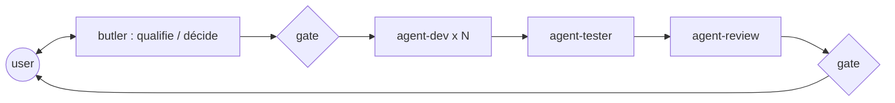

# ai-dev-crew

_Bibliothèque personnelle de skills et d'agents Claude Code. Pas un marketplace._

## Ce que c'est

Un jeu de **skills** — des checklists opposables, courtes et vérifiables — plus quelques
**agents** qui ne sont que des façons commodes de les charger. Les skills portent tout le
comportement ; les agents n'apportent que ce qu'une skill ne peut pas porter : une
restriction d'outils et un contexte vierge.

La bibliothèque **est** le produit. Les agents sont une commodité, jamais une dépendance :
tout ce que fait le crew se fait à la main, une skill à la fois, dans une session nue.

## Deux modes d'usage

**Chez soi, avec Claude Code.** Les skills de `.claude/skills/` et les agents de
`.claude/agents/` sont auto-découverts quand on travaille dans ce dépôt. Pour les avoir
partout, lier la bibliothèque dans son répertoire personnel :

```bash
ln -s "$PWD/.claude/skills"/* ~/.claude/skills/
ln -s "$PWD/.claude/agents"/* ~/.claude/agents/
claude --agent agent-butler   # session pilotée par le butler
```

**Sur site, sans installation et sans choix du modèle.** Aucun plugin, aucun agent : on
ouvre les fichiers du travail en cours et on les colle dans la conversation. Le routeur
`crew/SKILL.md` liste les fichiers à coller ensemble. Chaque fichier tient
dans une fenêtre de collage — voir la règle de granularité dans [`docs/doctrine.md`](./docs/doctrine.md).

## Les skills

Deux. **Une skill ne nomme jamais une autre skill** : elle ne référence que ses propres
fichiers, donc elle marche seule, collée ou chargée ([ADR 0016](./docs/adr/0016-one-crew-skill-role-as-mode.md)).

| Commande | Quand |
| --- | --- |
| `/crew` | développer, tester, relire, orchestrer, décider, veiller |
| `/crew-project` | le domaine ou les noms maison ne se voient pas dans le code |

`/crew` détecte la techno, choisit le rôle, et c'est tout :

```
/crew  →  techno détectée  →  agents/agent-dev.md  →  technos/java.md  →  references/…
```

| Flag | Agent | Rôle |
| --- | --- | --- |
| *(aucun)* · `-d` | `agent-dev` | développe, écrit les tests |
| `-t` | `agent-tester` | lance la suite complète, corrige les tests rouges |
| `-r` | `agent-review` | relit qualité + sécurité, rend un verdict |
| `-b` | `agent-butler` | qualifie, lance les autres rôles, tient les gates |
| `-a` | `agent-butler` | tranche une décision à arbitrages, en dialogue |
| `-w` | `agent-butler` | veille sur les règles de la bibliothèque |

`-c` lance le rôle en subagent au lieu de le lire en place.

**Garde d'indépendance** : `-t` ou `-r` dans la conversation qui a fait `-d` sur le même
changement produit un « Self-check — not the gate », jamais un verdict.

Les références se chargent **par contexte**, jamais par défaut. Chaque techno liste les
siennes ; la détection se fait sur le fichier de build **le plus proche** du fichier modifié.

Une référence porte deux sections : **`## Règles` fait autorité, `## Pourquoi` explique.**

**Rien de projet ni d'employeur n'est committé.** Les fichiers projet vivent dans
`crew-project/`, gitignorés, et se suppriment au départ du poste. **La techno se détecte,
le domaine se déclare.**

## Les agents

`.claude/agents/` contient 4 shells lançables. Chacun précharge `crew`, pointe vers son
fichier dans `crew/agents/`, et n'apporte qu'un contexte vierge et des outils restreints :

| Shell | Outils retirés |
| --- | --- |
| `agent-dev` | `Agent` : il développe, il ne lance personne |
| `agent-tester` | `Agent` |
| `agent-review` | `Edit`, `Agent` : il ne peut pas réécrire ce qu'il relit |
| `agent-butler` | `Edit` ; précharge aussi `crew-project` — `claude --agent agent-butler` |



Le butler écrit dans `docs/adr/` et `docs/design/`, le review dans `docs/reviews/` — du
projet client. Les rapports du dev et du tester sont conversationnels.

## Principes

Spécification faisant foi : [`docs/SPEC.md`](./docs/SPEC.md). Règles d'arbitrage :
[`docs/doctrine.md`](./docs/doctrine.md). Chaque décision non évidente est un ADR sous
[`docs/adr/`](./docs/adr/).

- **Les skills sont le crew ; les agents en sont des instanciations** — [ADR 0008](./docs/adr/0008-skills-first-doctrine.md)
- **Agents fins, skills épaisses** — aucune connaissance techno dans un agent — [ADR 0002](./docs/adr/0002-thin-agents-fat-skills.md)
- **Une règle, un seul domicile ; une skill ne nomme aucune autre skill** — [ADR 0016](./docs/adr/0016-one-crew-skill-role-as-mode.md)
- **Outils restreints par rôle** — [ADR 0004](./docs/adr/0004-role-tool-allowlists.md)
- **Preuve avant affirmation** — `agent-dev` attache la sortie réelle des commandes — [ADR 0005](./docs/adr/0005-verification-loop.md)
- **Les specs sont consommées, pas produites** — le crew lit `docs/adr/` et `docs/design/`, d'où qu'ils viennent (BMAD, Spec Kit, ou le butler lui-même)

## Layout

```
ai-dev-crew/
├── .claude/
│   ├── skills/
│   │   ├── crew/           SKILL.md
│   │   │                   agents/{agent-dev,agent-tester,agent-review,agent-butler}.md
│   │   │                   technos/{java,angular,node-bff,python}.md
│   │   │                   references/*.md (16)
│   │   └── crew-project/   SKILL.md  (index.md · <projet>.md — gitignorés)
│   └── agents/             4 shells lançables
├── .githooks/pre-commit    lance scripts/crew-doctor.sh
├── docs/                   SPEC.md · doctrine.md · skill-manifest.csv · adr/ · design/ · plans/ · reviews/ · watch/
├── scripts/crew-doctor.sh  contrôle structurel
└── CHANGELOG.md · CONTRIBUTING.md · README.md
```

## Chantiers ouverts

- `references/angular-patterns.md` est vide : `technos/angular.md` n'a pas encore de `## Pourquoi`
- `technos/python.md` est parqué — conservé, pas maintenu
- Le test de routage live ([ADR 0014](./docs/adr/0014-activity-first-skill-agent-pattern.md)) et les évaluations par mode restent à faire
- [ADR 0009](./docs/adr/0009-model-routing.md) ne vaut qu'en local, là où le modèle se choisit
