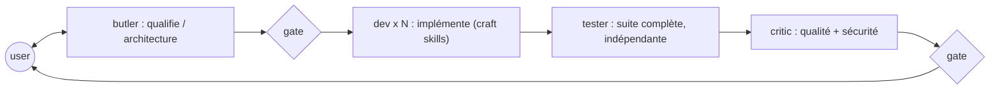

# ai-dev-crew

_Bibliothèque personnelle de skills et d'agents Claude Code. Pas un marketplace._

## Ce que c'est

Un jeu de **skills** — des checklists opposables, courtes et vérifiables — plus quelques
**agents** qui ne sont que des façons commodes de les charger. Les skills portent tout le
comportement ; les agents n'apportent que ce qu'une skill ne peut pas porter : une
restriction d'outils et un contexte vierge.

La bibliothèque **est** le produit. Les agents sont une commodité, jamais une dépendance :
tout ce que fait le crew se fait à la main, une skill à la fois, dans une session nue.

## Deux modes d'usage

**Chez soi, avec Claude Code.** Les skills de `.claude/skills/` et les agents de
`.claude/agents/` sont auto-découverts quand on travaille dans ce dépôt. Pour les avoir
partout, lier la bibliothèque dans son répertoire personnel :

```bash
ln -s "$PWD/.claude/skills"/* ~/.claude/skills/
ln -s "$PWD/.claude/agents"/* ~/.claude/agents/
```

**Sur site, sans installation et sans choix du modèle.** Aucun plugin à installer, aucun
agent à déclarer : on ouvre le `SKILL.md` qui correspond au travail en cours et on le colle
dans la conversation. C'est pour ça que chaque `SKILL.md` tient dans une fenêtre de collage
— voir la règle de granularité dans [`docs/doctrine.md`](./docs/doctrine.md).

En mode collage, les renvois par nom (« applique `testfix` ») sont des liens morts : le
modèle n'a que ce qu'on lui a donné. Les fichiers d'entrée déclarent donc en tête ce qu'il
faut coller avec eux.

## Les skills

Quatre familles. L'inventaire à jour, avec le statut de chacune, est dans
[`docs/skill-manifest.csv`](./docs/skill-manifest.csv).

| Famille | Skills | Ce qu'elles décident |
| --- | --- | --- |
| **Procédure** | `dev-loop` · `testfix` · `test-craft` · `code-quality` · `security-review` · `dev-conventions` · `architecture` | comment on travaille |
| **Langage / framework** | `java-craft` · `angular-craft` · `node-bff-craft` · `python-craft` | les idiomes d'une techno |
| **Structure** | `layering-craft` · `persistence-craft` | ce qui traverse quelle couche, comment une entité est mappée |
| **Contrats** | `api-rest-craft` · `kafka-craft` · `ws-craft` | la forme de ce qu'on expose |
| **Maintenance** | `watch` | ce qui empêche les trois familles ci-dessus de pourrir |

Les deux dernières familles sont **transverses au langage** : la discipline entity/DTO/mapper
et le style d'URL valent autant côté Java que côté BFF Node. C'est pourquoi elles ne vivent
pas dans `java-craft`.

Les craft skills portent un dossier `references/` :

| | `best-practices.md` | `house-rules.md` |
| --- | --- | --- |
| Répond à | quoi et pourquoi | avec quoi ici |
| Source | veille, doc officielle | lecture de la codebase de l'employeur |
| Durée de vie | toute la carrière | meurt avec le poste |
| Committé | oui | **jamais** — gitignoré, seul le template l'est |

`.claude/skills/persistence-craft/` sert de référence de format.

Et `SKILL.md` fait autorité : `best-practices.md` explique, il ne légifère pas. Si les deux
se contredisent, c'est le fonds qui a tort. C'est ce qui empêche les deux fichiers d'être
deux domiciles pour une même règle — voir [ADR 0010](./docs/adr/0010-watch-craft-maintenance-loop.md).

Ces fonds vieillissent, donc `watch` les entretient : une passe périodique qui ne retient
d'une nouveauté que ce qui **rend une règle existante fausse ou incomplète**, écrit un digest
dans `docs/watch/`, et ouvre **une PR par skill impactée** — jamais de commit direct, parce
que relire la PR est à la fois le garde-fou et le moment où on apprend.

## Les agents

Quatre, dans `.claude/agents/`. Chacun ne se justifie que par ce qu'il ne peut pas faire ou
par ce qu'il n'a pas vu :

| Agent | Ce qu'il apporte hors de ses skills |
| --- | --- |
| `agent-crew-butler` | orchestration et gates utilisateur — non réductible à une skill ([ADR 0008](./docs/adr/0008-skills-first-doctrine.md)) |
| `agent-crew-critic` | contexte vierge + aucun `Edit` : il ne peut pas réécrire ce qu'il relit |
| `agent-crew-tester` | instance fraîche, indépendante de qui a écrit le code |
| `agent-crew-dev` | parallélisme sur fichiers disjoints |

Coordination par **fichiers**, jamais par conversation entre agents, avec une validation
utilisateur entre chaque phase :



Le butler écrit dans `docs/adr/` et `docs/design/`, le critic dans `docs/reviews/` — du
projet client. Les rapports du dev et du tester sont conversationnels, pas des fichiers.

## Principes

Spécification faisant foi : [`docs/SPEC.md`](./docs/SPEC.md). Règles d'arbitrage :
[`docs/doctrine.md`](./docs/doctrine.md). Chaque décision non évidente est un ADR sous
[`docs/adr/`](./docs/adr/).

- **Les skills sont le crew ; les agents en sont des instanciations** — [ADR 0008](./docs/adr/0008-skills-first-doctrine.md)
- **Agents fins, skills épaisses** — aucune connaissance techno dans un agent — [ADR 0002](./docs/adr/0002-thin-agents-fat-skills.md)
- **Une règle, un seul domicile** — une skill qui a besoin de la logique d'une autre la cite par son nom, ne la recopie jamais
- **Outils restreints par rôle** — [ADR 0004](./docs/adr/0004-role-tool-allowlists.md)
- **Preuve avant affirmation** — `dev-loop` attache la sortie réelle des commandes — [ADR 0005](./docs/adr/0005-verification-loop.md)
- **Les specs sont consommées, pas produites** — le crew lit `docs/adr/` et `docs/design/`, d'où qu'ils viennent (BMAD, Spec Kit, ou le butler lui-même)

## Layout

```
ai-dev-crew/
├── .claude/
│   ├── skills/<nom>/SKILL.md [+ references/]
│   └── agents/agent-crew-*.md
├── docs/
│   ├── SPEC.md · doctrine.md · skill-manifest.csv
│   ├── adr/ · design/ · plans/ · reviews/ · templates/
├── scripts/
├── CHANGELOG.md · CONTRIBUTING.md · README.md
└── .attic/            vestiges de l'ère plugin, gitignoré
```

## Chantiers ouverts

Migration structurelle faite, alignement doctrinal en cours :

- `docs/SPEC.md` §1 et §3 décrivent encore une organisation en plugins
- [ADR 0001](./docs/adr/0001-plugin-marketplace-format.md) est falsifié (son contexte suppose une installation chez le client) et doit être remplacé ; [ADR 0009](./docs/adr/0009-model-routing.md) ne vaut qu'en local, là où le modèle se choisit
- `scripts/crew.sh` et `scripts/crew-doctor.sh` sont bâtis sur l'installation de plugins : inopérants en l'état
- `angular-craft` recopie les règles de tier de `test-craft` — une seule doit les porter
- `java-craft` reste à approfondir ; `layering-craft`, `api-rest-craft`, `kafka-craft`,
  `ws-craft` et `node-bff-craft` sont des squelettes marqués `À PEUPLER`
