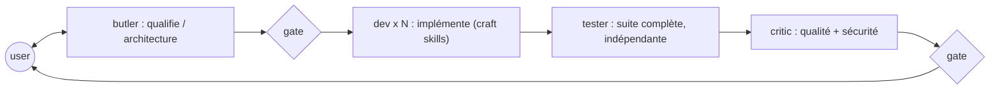

# ai-dev-crew

_Bibliothèque personnelle de skills et d'agents Claude Code. Pas un marketplace._

## Ce que c'est

Un jeu de **skills** — des checklists opposables, courtes et vérifiables — plus quelques
**agents** qui ne sont que des façons commodes de les charger. Les skills portent tout le
comportement ; les agents n'apportent que ce qu'une skill ne peut pas porter : une
restriction d'outils et un contexte vierge.

La bibliothèque **est** le produit. Les agents sont une commodité, jamais une dépendance :
tout ce que fait le crew se fait à la main, une skill à la fois, dans une session nue.

## Deux modes d'usage

**Chez soi, avec Claude Code.** Les skills de `.claude/skills/` et les agents de
`.claude/agents/` sont auto-découverts quand on travaille dans ce dépôt. Pour les avoir
partout, lier la bibliothèque dans son répertoire personnel :

```bash
ln -s "$PWD/.claude/skills"/* ~/.claude/skills/
ln -s "$PWD/.claude/agents"/* ~/.claude/agents/
```

**Sur site, sans installation et sans choix du modèle.** Aucun plugin à installer, aucun
agent à déclarer : on ouvre le `SKILL.md` qui correspond au travail en cours et on le colle
dans la conversation. C'est pour ça que chaque `SKILL.md` tient dans une fenêtre de collage
— voir la règle de granularité dans [`docs/doctrine.md`](./docs/doctrine.md).

En mode collage, les renvois par nom (« applique `testfix` ») sont des liens morts : le
modèle n'a que ce qu'on lui a donné. Les fichiers d'entrée déclarent donc en tête ce qu'il
faut coller avec eux.

## Les skills

Cinq, indexées par **activité** — parce que l'activité est la seule chose que tu connaisses au moment où tu tapes la commande. Quelle techno tu touches se découvre *pendant*, donc ça se route, ça ne se tape pas.

| Commande | Quand | Ce qu'elle porte |
| --- | --- | --- |
| `/crew-dev` | implémenter ou corriger du code | la boucle dev, la table de détection, 4 personas, 10 références |
| `/crew-review` | faire passer un gate formel | la procédure de revue, lentilles qualité et sécurité |
| `/crew-test` | un test est rouge, ou il faut vérifier indépendamment | critère de tier, scénarios, suite complète, testfix |
| `/architecture` | une décision a de vrais arbitrages | discipline ADR, alternatives, réversibilité |
| `/watch` | les références risquent de vieillir | diff doctrinal, digest, une PR par fichier impacté |

La composition est un **graphe**, pas un arbre — quatre arêtes, aucune n'excluant les autres :

```
/crew-dev ─── skill
│
├─ ses références          conventions · layering · api-rest
│                          persistence · kafka · ws     ← chargées selon le contexte
│
└─ charge  agent-java ─── persona
      ├─ ses références    java-spring · persistence · kafka · ws
      └─ peut appeler      /crew-test · /architecture
```

Les références se chargent **par contexte**, jamais par défaut : tu touches un DTO → `layering`, une entité → `persistence`, un endpoint → `api-rest`. La détection se fait sur des faits observables — extensions, fichiers de build, annotations — pas sur un jugement.

Une référence fusionnée porte deux sections : **`## Règles` fait autorité, `## Pourquoi` explique, et en cas de désaccord c'est `## Règles` qui a raison.**

`house-rules.md` — les noms et choix propres à l'employeur — est **gitignoré**. Seul `docs/templates/house-rules.template.md` est committé.

Et `/watch` entretient tout ça : une passe périodique qui ne retient d'une nouveauté que ce qui **rend une règle existante fausse ou incomplète**, écrit un digest dans `docs/watch/`, et ouvre **une PR par fichier impacté** — jamais de commit direct, parce que relire la PR est à la fois le garde-fou et le moment où on apprend.

## Les agents

Quatre, dans `.claude/agents/`. Chacun ne se justifie que par ce qu'il ne peut pas faire ou
par ce qu'il n'a pas vu :

| Agent | Ce qu'il apporte hors de ses skills |
| --- | --- |
| `agent-crew-butler` | orchestration et gates utilisateur — non réductible à une skill ([ADR 0008](./docs/adr/0008-skills-first-doctrine.md)) |
| `agent-crew-critic` | contexte vierge + aucun `Edit` : il ne peut pas réécrire ce qu'il relit |
| `agent-crew-tester` | instance fraîche, indépendante de qui a écrit le code |
| `agent-crew-dev` | il a lu la table de détection, donc il sait quelle persona dispatcher |
| `agent-java` · `agent-angular` · `agent-node-bff` · `agent-python` | shells vers les personas : un contexte isolé par techno, dispatchables en parallèle sur fichiers disjoints |

Coordination par **fichiers**, jamais par conversation entre agents, avec une validation
utilisateur entre chaque phase :



Le butler écrit dans `docs/adr/` et `docs/design/`, le critic dans `docs/reviews/` — du
projet client. Les rapports du dev et du tester sont conversationnels, pas des fichiers.

## Principes

Spécification faisant foi : [`docs/SPEC.md`](./docs/SPEC.md). Règles d'arbitrage :
[`docs/doctrine.md`](./docs/doctrine.md). Chaque décision non évidente est un ADR sous
[`docs/adr/`](./docs/adr/).

- **Les skills sont le crew ; les agents en sont des instanciations** — [ADR 0008](./docs/adr/0008-skills-first-doctrine.md)
- **Agents fins, skills épaisses** — aucune connaissance techno dans un agent — [ADR 0002](./docs/adr/0002-thin-agents-fat-skills.md)
- **Une règle, un seul domicile** — une skill qui a besoin de la logique d'une autre la cite par son nom, ne la recopie jamais
- **Outils restreints par rôle** — [ADR 0004](./docs/adr/0004-role-tool-allowlists.md)
- **Preuve avant affirmation** — `dev-loop` attache la sortie réelle des commandes — [ADR 0005](./docs/adr/0005-verification-loop.md)
- **Les specs sont consommées, pas produites** — le crew lit `docs/adr/` et `docs/design/`, d'où qu'ils viennent (BMAD, Spec Kit, ou le butler lui-même)

## Layout

```
ai-dev-crew/
├── .claude/
│   ├── skills/
│   │   ├── crew-dev/      SKILL.md · agents/agent-{java,angular,node-bff,python}.md
│   │   │                  references/{conventions,layering,api-rest,persistence,
│   │   │                              kafka,ws,java-spring,node-bff,angular-patterns}.md
│   │   ├── crew-review/   SKILL.md · references/{code-quality,security-review}.md
│   │   ├── crew-test/     SKILL.md · references/testfix.md
│   │   ├── architecture/  SKILL.md
│   │   └── watch/         SKILL.md · references/sources.md
│   └── agents/            4 rôles (butler, dev, tester, critic)
│                          + 4 shells techno liés aux personas
├── docs/
│   ├── SPEC.md · doctrine.md · skill-manifest.csv
│   └── adr/ · design/ · plans/ · reviews/ · templates/ · watch/
├── scripts/
├── CHANGELOG.md · CONTRIBUTING.md · README.md
└── .attic/                vestiges de l'ère plugin, gitignoré
```

## Chantiers ouverts

Migration structurelle faite, alignement doctrinal en cours :

- [ADR 0001](./docs/adr/0001-plugin-marketplace-format.md) est falsifié (son contexte suppose une installation chez le client) et doit être remplacé ; [ADR 0009](./docs/adr/0009-model-routing.md) ne vaut qu'en local, là où le modèle se choisit
- `scripts/crew.sh` et `scripts/crew-doctor.sh` sont bâtis sur l'installation de plugins : inopérants en l'état
- `angular-craft` recopie les règles de tier de `test-craft` — une seule doit les porter
- `java-craft` reste à approfondir ; `layering-craft`, `api-rest-craft`, `kafka-craft`,
  `ws-craft` et `node-bff-craft` sont des squelettes marqués `À PEUPLER`
